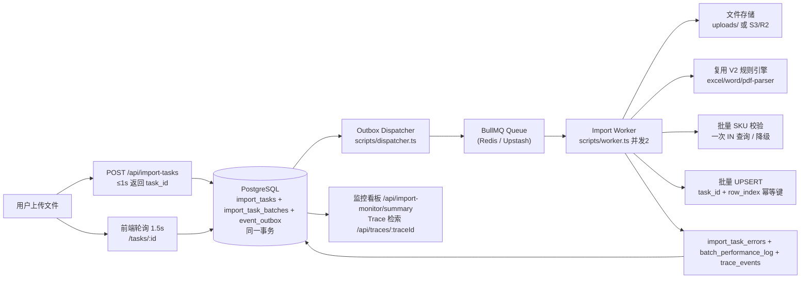

# 架构设计文档（PRD 提交物 #6）

## 1. 总体架构：异步事件驱动

## 2. 核心模式

| 模式 | 落地 |
|---|---|
| 异步任务表 | `import_tasks`：status/total_rows/processed_rows/success_rows/failed_rows/total_batches/completed_batches/trace_id/degraded |
| 分批任务 | `import_task_batches`：2,000 行/批（PRD 4.1 允许 500/1000/2000），unit_id 唯一，状态机 pending→processing→completed |
| Transactional Outbox | `event_outbox`：任务+批次+事件同事务创建；Dispatcher 轮询投递，SKIP LOCKED 防并发 |
| 批量校验 | Worker 内收集批次 SKU → 一次 `IN` 查询 → Map 匹配（禁逐行） |
| 批量写入 | `orders` 基于 `@@unique([taskId, rowIndex])` 批量 UPSERT（禁逐行 INSERT） |
| 精细化错误 | `import_task_errors`：行号/字段/错误码 E001-E008/脱敏原始值，分页查询 |
| 性能日志 | `batch_performance_log`：parse/rule/validate/insert/total 五阶段耗时 |
| 链路追踪 | `trace_events`：trace_id 贯穿 API→Outbox→Queue→Worker→DB |

## 3. 状态流转

任务状态：`pending → processing → completed | partial_success | failed`

批次状态：`pending → processing → completed`（失败回滚 pending 交由 BullMQ 重试，最多 5 次）

Outbox 状态：`pending → sent | failed`（失败指数退避重试 1/5/30/120/600 秒，超 5 次 failed + 告警 Trace）

## 4. 幂等设计

1. **业务键**：`orders` 唯一约束 `(task_id, row_index)`，UPSERT 基于此键；
2. **批次抢占**：`UPDATE import_task_batches SET status='processing' WHERE task_id=? AND unit_id=? AND status='pending'`，仅抢占者执行；
3. **已完成快速路径**：批次 `completed` 直接返回；
4. **进度防重**：`processed_rows/success_rows/failed_rows/completed_batches` 仅在 `processing→completed` 原子更新内 `increment`；
5. **Outbox 防重复领取**：`SELECT ... FOR UPDATE SKIP LOCKED`。

## 5. 容灾与降级（PRD 模块十）

- SKU 主数据查询超时（>3s）或 DB 短暂失败 → 降级模式：跳过 E001 校验，仅本地格式校验；
- 降级不静默：`import_tasks.degraded=true` + `degraded_reason` + Trace 事件 + 前端明确提示；
- Outbox 未投递事件在宕机恢复后由 Dispatcher 继续投递；
- 批次处理异常回滚 pending，由队列重试，不丢数据。

## 6. 部署拓扑

| 组件 | 承载 | 说明 |
|---|---|---|
| Next.js API + 前端 | Vercel | 上传/查询/监控接口，无长任务 |
| Outbox Dispatcher | Railway/Render/Fly.io 常驻进程 | `npm run dispatcher` |
| Import Worker | Railway/Render/Fly.io 常驻进程 | `npm run worker`（可多实例） |
| PostgreSQL | Neon/Supabase/自建 | 业务数据 + Outbox |
| Redis | Upstash/本地 | BullMQ 队列 |
| 文件存储 | 本地 uploads / S3/R2 | `STORAGE_BACKEND` 切换 |

## 7. 事件契约（PRD 第九章）

统一信封：`event_id / event_type / schema_version / aggregate_id / trace_id / occurred_at / payload`

已定义事件：`ImportTaskCreated`、`ImportBatchCreated`、`ImportBatchStarted`、`ImportBatchSucceeded`、`ImportBatchFailed`、`ImportTaskCompleted`、`ImportTaskPartialSuccess`、`ImportTaskDegraded`（schema_version=1，新增字段向后兼容，消费者忽略未知字段）。

## 8. 容量规划摘要

- 处理单元：2,000 行/批，6 批（10,000 行）；
- 压测直连脚本消费并发 6（= 批次数，一轮完成）；生产 Worker 并发 2（可扩至 2~4 实例）；
- 数据库峰值连接：消费并发 × 事务连接（Prisma 连接池复用）；
- 实测全链路 53.5s ≤ 60s 目标（详见 ASSUMPTIONS.md 第 4 节与压测报告）。
